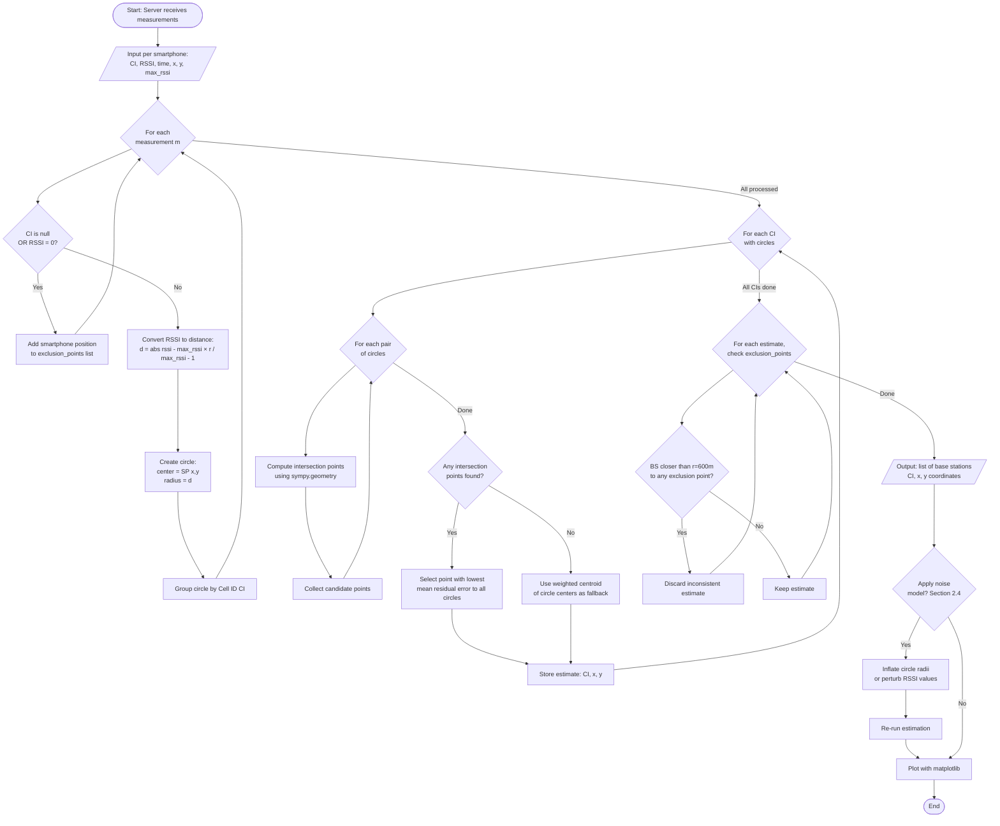
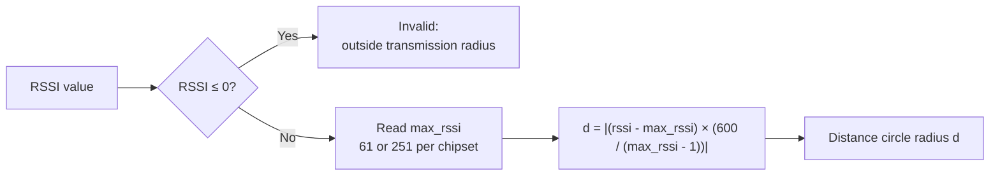
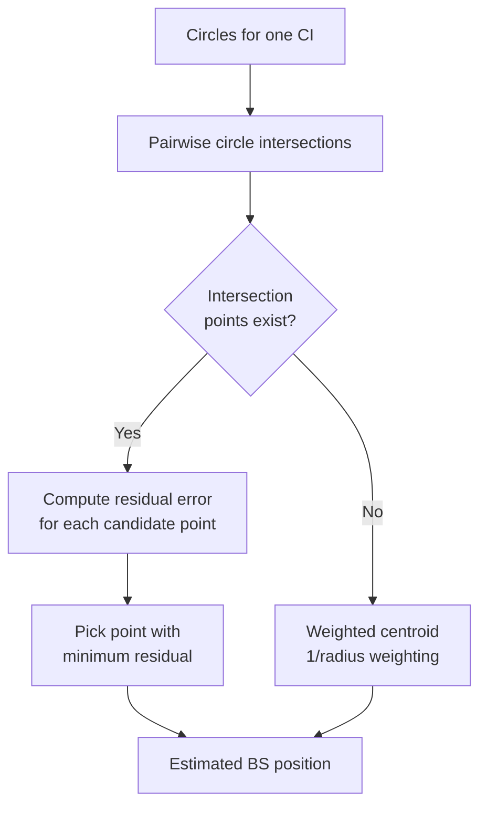
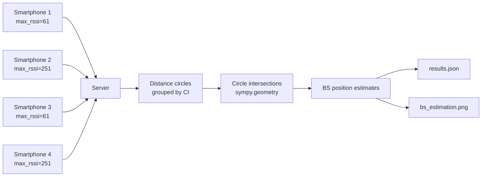

# Lab 3 – Algorithm Flowchart

Flowchart for the swarm mapping algorithm (sections 2.1–2.2).

## Main Process Flow

## RSSI to Distance Conversion

## Per-CI Position Estimation

## Data Flow Overview

## Legend

| Symbol | Meaning |
|--------|---------|
| `r` | Transmission radius = 600 m (urban GSM) |
| `max_rssi` | 61 (SP1, SP3) or 251 (SP2, SP4) |
| `RSSI = 0` | Smartphone outside all known base stations |
| `CI = "-"` | No base station in range; used as exclusion point |
| Residual error | Mean absolute deviation from each circle boundary |
