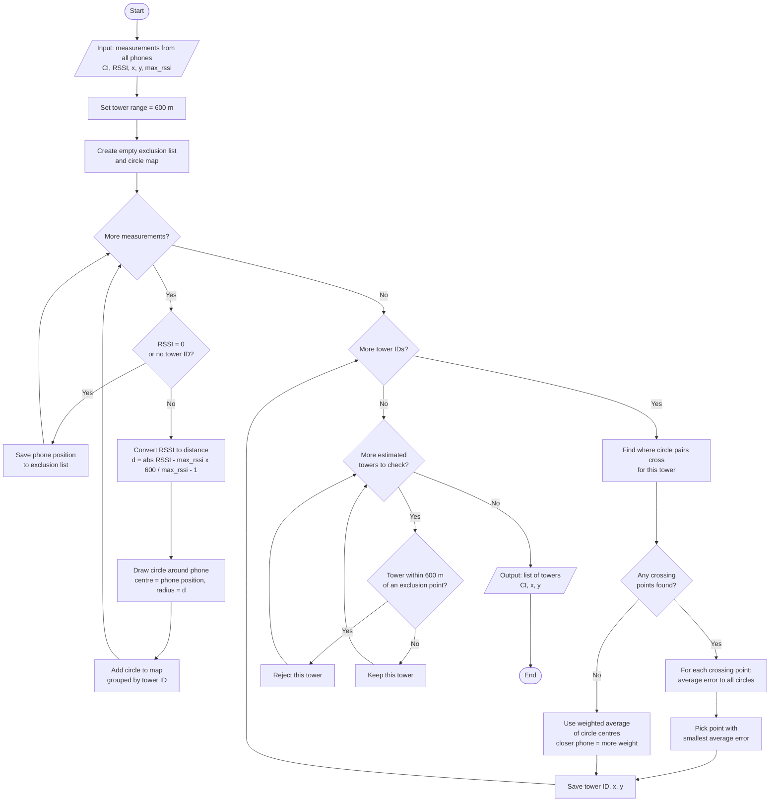

# Lab 3 – Flowchart

One complete flowchart for the swarm mapping algorithm (Section 2.1).

**Shapes used (standard flowchart symbols):**

| Shape | Meaning |
|-------|---------|
| Oval `([ ])` | Start / End |
| Rectangle `[ ]` | Process step — do something |
| Diamond `{ }` | Decision — Yes or No |
| Parallelogram `[/ /]` | Input / Output |

---

---

## Shape Legend

| Symbol in diagram | Name | Used for |
|-------------------|------|----------|
| Oval | Terminal | Start and End |
| Rectangle | Process | Actions: convert, draw, save, reject |
| Diamond | Decision | Questions with Yes / No paths |
| Parallelogram | Input/Output | Data going in or results going out |

## Term Legend

| Term | Meaning |
|------|---------|
| **CI** | Tower ID (Cell ID) |
| **RSSI** | Signal strength — higher means closer |
| **max_rssi** | Max signal for that phone chip (61 or 251) |
| **600 m** | Tower transmission range |
| **Exclusion point** | Phone with RSSI = 0 — heard no tower |
| **Average error** | Mean of abs distance to phone minus circle radius |
